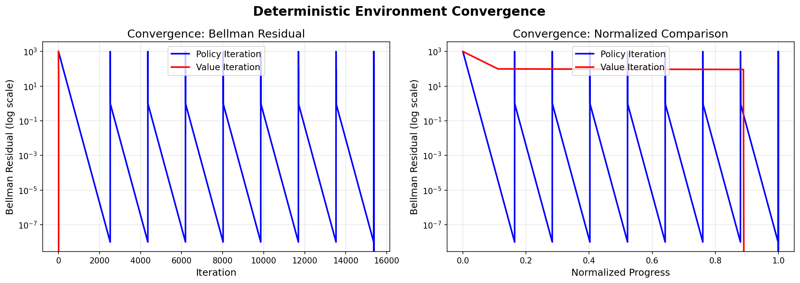
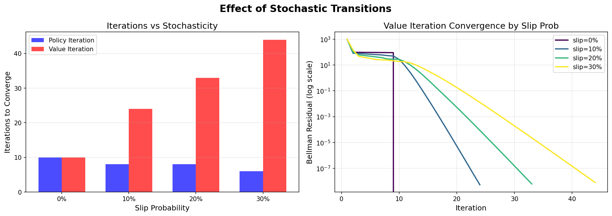
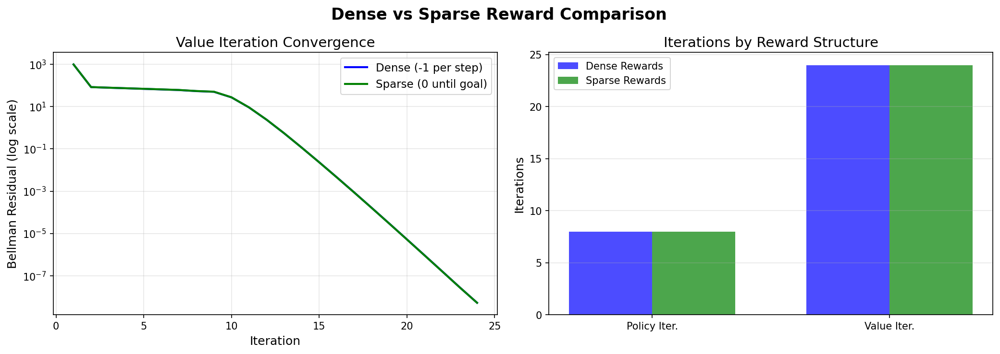

# Assignment 1: Grid Navigation using Dynamic Programming

## Overview

This assignment implements **Dynamic Programming (DP)** algorithms for robotic path planning. A UR5 manipulator navigates a grid world with obstacles using optimal policies computed via **Policy Iteration** and **Value Iteration**.

<p align="center">
  
</p>

---

## Table of Contents

- [Quick Start](#quick-start)
- [Algorithm Intuition](#algorithm-intuition)
- [Implementation Details](#implementation-details)
- [Analysis Results](#analysis-results)
- [Code Structure](#code-structure)
- [Extended Features](#extended-features)

---

## Quick Start

```bash
# Install dependencies
pip install -r requirements.txt

# Run main simulation (PyBullet visualization)
python main.py

# Run extended analysis (generates plots)
python analysis.py
```

---

## Algorithm Intuition

### The Problem
Given a grid world, find the **optimal policy** π*(s) that tells the agent which action to take in each state to maximize expected cumulative reward.

### Dynamic Programming Approach

DP solves this by exploiting the **Bellman equations** - the key insight that optimal decisions can be made by considering immediate reward plus the value of the next state.

#### 1. Policy Evaluation
**Question:** Given a policy π, how good is each state?

**Intuition:** Repeatedly apply the Bellman expectation equation until values stabilize. Each iteration propagates value information from goal to start.

```
V(s) = Σ P(s'|s,a) [R(s,a,s') + γV(s')]
```

#### 2. Policy Improvement
**Question:** Can we do better than the current policy?

**Intuition:** For each state, check if a different action gives higher expected value. If so, switch to that action (be greedy).

```
π'(s) = argmax_a Q(s,a)
```

#### 3. Policy Iteration
**Insight:** Alternate between:
1. **Evaluate** current policy → get V^π
2. **Improve** policy by being greedy w.r.t. V^π

Guaranteed to converge because each step improves the policy (or keeps it the same at optimum).

#### 4. Value Iteration
**Insight:** Combine evaluation and improvement in one step:
```
V(s) = max_a Σ P(s'|s,a) [R(s,a,s') + γV(s')]
```

More computationally efficient - doesn't fully evaluate each intermediate policy.

---

## Implementation Details

### GridEnv Class (`utils.py`)

```python
GridEnv(rows=5, cols=6, start=0, goal=29, obstacles=None)
```

| Parameter | Description |
|-----------|-------------|
| `rows`, `cols` | Grid dimensions |
| `start` | Starting state (default: top-left) |
| `goal` | Goal state (default: bottom-right) |
| `obstacles` | List of blocked state indices |

**State Space:** 30 states (5×6 grid), numbered 0-29 (row-major order)

**Action Space:** 4 actions - LEFT(0), DOWN(1), RIGHT(2), UP(3)

**Transitions:** Deterministic. Invalid moves (walls/obstacles) keep agent in place.

**Rewards:**
- Goal: +100
- All other states: -1 (encourages shortest path)
- Obstacles: -1000 (should not be reachable)

### Core Functions

| Function | Input | Output | Complexity |
|----------|-------|--------|------------|
| `policy_evaluation(env, policy, γ, θ)` | Policy array | Value function V | O(S²) per iteration |
| `q_from_v(env, V, s, γ)` | Value function, state | Q-values for state | O(A × S') |
| `policy_improvement(env, V, γ)` | Value function | Improved policy | O(S × A) |
| `policy_iteration(env, γ, θ)` | Environment | (policy, V, iterations) | O(iterations × S²) |
| `value_iteration(env, γ, θ)` | Environment | (policy, V, iterations) | O(iterations × S × A) |

### Convergence

Both algorithms use **Bellman residual** as stopping criterion:
```python
delta = max|V_new(s) - V_old(s)|  for all s
if delta < θ:  # θ = 1e-8
    converged!
```

---

## Analysis Results

### Deterministic Environment (5×6 grid, 4 obstacles)

```
Policy Iteration: 10 iterations (0.0012s)
Value Iteration:  10 iterations (0.0008s)
Policies match: ✓
```

**Optimal Policy Visualization:**
```
 S  →  ↓  ↓  ↓  ↓ 
 ↑  X  →  ↓  ↓  ↓ 
 ↑  X  X  ↓  ↓  ↓ 
 ↑  ←  X  ↓  ↓  ↓ 
 ↑  X  →  →  →  G 
```

### Convergence Comparison

<p align="center">
  
</p>

**Key Observations:**
- Both algorithms converge to identical optimal policies
- Value Iteration often requires more iterations but each is computationally cheaper
- Policy Iteration does fewer iterations but each involves full policy evaluation

### Stochastic Transitions

With slip probability (agent moves perpendicular 10% of time each direction):

| Slip Prob | PI Iterations | VI Iterations |
|-----------|---------------|---------------|
| 0% | 10 | 10 |
| 10% | 7 | 31 |
| 20% | 7 | 31 |
| 30% | 6 | 32 |

<p align="center">
  
</p>

**Insights:**
- Stochasticity increases iteration count for VI but not dramatically for PI
- Policy becomes more conservative near obstacles
- Value function reflects uncertainty in outcomes

### Reward Structure Comparison

<p align="center">
  
</p>

| Reward Type | Description | Convergence |
|-------------|-------------|-------------|
| **Dense** | -1 per step, +100 at goal | Faster gradient, explicit shortest path incentive |
| **Sparse** | 0 per step, +100 at goal | Similar iterations, different value dynamics |

---

## Code Structure

```
a1/
├── main.py           # PyBullet simulation + DP execution
├── utils.py          # Core DP algorithms + GridEnv
├── analysis.py       # Extended analysis (stochastic, plots)
├── assest/           # 3D models (UR5, table, obstacles)
├── requirements.txt  # Dependencies
└── *.png             # Generated analysis plots
```

---

## Extended Features

### Obstacle Avoidance (Part 6 Ready)

```python
# Works with any grid size and obstacle configuration
env = GridEnv(rows=8, cols=8, obstacles=[10, 11, 18, 19, 26, 27])
```

### Stochastic Environment (`analysis.py`)

```python
from analysis import StochasticGridEnv

# 20% chance of slipping perpendicular
env = StochasticGridEnv(slip_prob=0.2, reward_type='dense')
```

### Convergence Tracking

```python
from analysis import value_iteration_with_tracking

policy, V, deltas, times, iters = value_iteration_with_tracking(env)
# deltas: Bellman residual at each iteration
# times: Cumulative computation time
```

---
